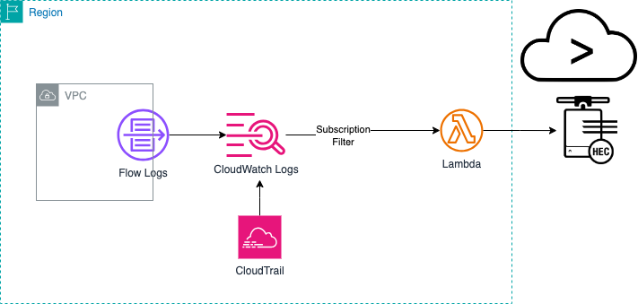

# splunk-aws-lambda-cloudwatchlogs-processor
### Serverless Application for processing CloudWatch Logs to ingest into Splunk over HEC URL

## Content
This repo contains source code and supporting files for a serverless application that you can deploy with the SAM CLI. It includes the following files and folders.

- SplunkLambdaCloudWatchLogsProcessor - Code for the application's Lambda function.
- template.yaml - A template that defines the application's AWS resources.

The resources used by the application are defined in the `template.yaml` file in this project. You can update the template to add AWS resources through the same deployment process that updates your application code.

## Solution Overview
This solution deploys a lambda function processor to unpack CloudWatch Logs and ingest into Splunk over HEC endpoint. 

## Deployment
1) Search for Serverless application by name **splunk-aws-lambda-cloudwatchlogs-processor** in the AWS console for [Serverless Repo](https://serverlessrepo.aws.amazon.com/applications) or in [Lambda](https://console.aws.amazon.com/lambda/home).
2) Review and Update the parameters under **Application Settings**:

| Sererless Parameter              | Lambda Env. Variable | Description                                                                     | Required | Default Value |   |
|----------------------------------|----------------------|---------------------------------------------------------------------------------|----------|---------------|---|
| SplunkHttpEventCollectorURL      | HEC_HOST             | Splunk HEC Endpoint URL                                                         | YES      | None          |   |
| SplunkHttpEventCollectorToken    | HEC_TOKEN            | Splunk HEC Token                                                                | YES      | None          |   |
| SplunkSourceType                 | SOURCE_TYPE          | Splunk Source Type for Data                                                     | YES      | None          |   |
| SplunkHttpEventCollectorType     | HEC_ENDPOINT_TYPE    | HEC input type for raw or event                                                 | NO       | raw           |   |
| SplunkAcknowledgementRequired    | ACK_REQUIRED         | Check Acknowledgement True or False                                             | NO       | false         |   |
| SplunkAcknowledgementRetries     | ACK_RETRIES          | Number of retries to check acknowledgement                                      | NO       | 5             |   |
| SplunkAcknowledgementWaitSeconds | ACK_WAIT_SECS        | Number of seconds to wait before acknowledgement                                | NO       | 5             |   |
| ELBCookieName                    | ELB_COOKIE_NAME      | Load balancer Cookie Name. AWSELB for Classic ELB or AWSALB for Applicaiton ELB | NO       | AWSELB        |   |
| HTTPRequestTimeout               | REQUEST_TIMEOUT      | Number of seconds for HTTP requests timeout                                     | NO       | 5             |   |
| HTTPVerifySSL                    | VERIFY_SSL           | True or False to verify SSL for HTTP requests                                   | NO       | true          |   |
| DebugData                        | DEBUG_DATA           | True or False to print data for debugging                                       | NO       | false         |   |

3) Deploy the application and wait for cloudformation to complete deploying the application. Note the Physical ID for the Lambda function. 
4) Go to CloudWatch in AWS (console)[https://console.aws.amazon.com/cloudwatch/home], select **Log Groups** and pick the log group to configure ingestion for Splunk.
5) Go to subscription filter tab and **Create Lambda subscription filter** under Create pull down menu.
6) Select the Lambda function you created from previous step to match the same Physical ID for the the function.
7) Enter subscription filter name and click **Start streaming**
8) Now you CloudWatch Logs should be streamed to Splunk. Check for the data in Splunk Console.

## Troubleshooting Lambda function using CloudWatch Insight logs.
Use the CloudWatch Log Insights and select the LogGroup of your deployed lambda function for troubleshooting. You can troubleshoot and monitor the execution of the lambda functions with the following CloudWatch Insight Queries. 
You can also set the **DEBUG_DATA** environment variable to *true* in the lambda function for further troubeshooting.
### To check the error messages
fields @message
    | parse @message "[*] *" as loggingType, loggingMessage
    | filter loggingType = "ERROR"
    | display loggingMessage

Tip: To troubleshoot error messages, turn on the DEBUG_DATA environment variable of the Lambd function to *true* and use CloudWatch logs for the lambda function to troubleshoot   

### To check the count of error messages by 5 mins interval
fields @message
    | parse @message "[*] *" as loggingType, loggingMessage
    | filter loggingType = "ERROR"
    | stats count() by bin(5m)

### To check if there are any connection errors 
fields @timestamp, @message  |
filter @message like /Connection Error/ 

### To get the count connection errors by 5 mins interval
fields @timestamp, @message  
| filter @message like /Connection Error/ 
| stats count() by bin(60m)

Tip: Check the network connectivity for any connection errors. If the Lambda function is a public function then ensure the Splunk endpoint is a public endpoint reachable over internet. If the endpoint is firewall protected then check this [link](https://ip-ranges.amazonaws.com/ip-ranges.json) for AWS public IP ranges and ensure the IP ranges for Lambda services for the AWS region where the Lambda runs are in allow list. If you have configured your Lambda for [VPC Access](https://docs.aws.amazon.com/lambda/latest/dg/configuration-vpc.html#vpc-configuring), ensure you have network connectivity to Splunk endpoints from your VPC where Lambda is configured. 

### To check if there are any Acknowledgement Failures
fields @timestamp, @message, @logStream, @log
| filter @message Like /Acknowledgement Failed/

### To check if there are any Acknowledgement Failures by 5 mins interval
fields @timestamp, @message, @logStream, @log
| filter @message Like /Acknowledgement Failed/
| stats count() by bin(60m)

Tip: The Lambda function checks for ingeestion acknowledgement if Application parameter **SplunkAcknowledgementRequired** or Lambda environment variable **ACK_REQUIRED** is set to *true*.  For any acknowledgement failures, try changing the Lambda environment variables for Acknowledgement (ACK_RETRIES & ACK_WAIT_SECS) to a higher values.